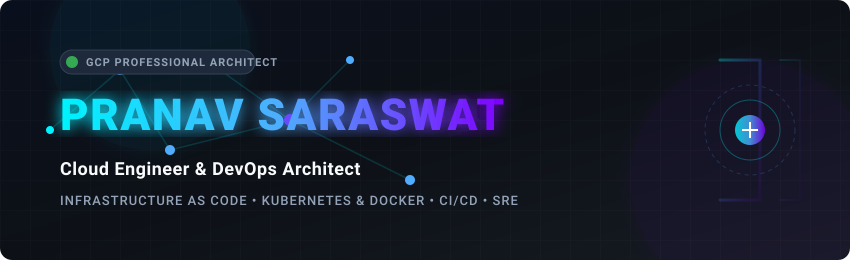
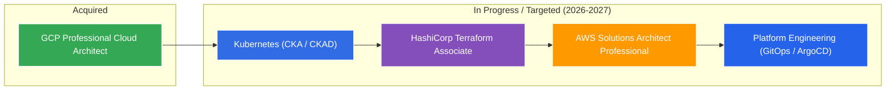

<!-- PRE-FLIGHT CHECK: Custom SVG Banner and asset files reside in /assets -->
<p align="center">
  
</p>

<p align="center">
  <!-- Visitor Counter -->
  
  <!-- GCP Certification Badge -->
  
  <!-- License Badge -->
  
</p>

<div align="center">
  
  <h1>Hey there! I'm Pranav Saraswat 👋</h1>

  <!-- Typing SVG Animation -->
  

  <p align="center">
    <strong>Slightly obsessed with automation, infrastructure reliability, and developer experience.</strong>
  </p>

  <!-- CTA Contact Badges -->
  <p align="center">
    <a href="https://linkedin.com/in/pranav-saraswat" target="_blank">
      
    </a>
    <a href="https://github.com/Pranav-Saraswat" target="_blank">
      
    </a>
    <a href="mailto:pranav.saraswat.dev@gmail.com">
      
    </a>
    <a href="https://twitter.com/pranavsaraswat0" target="_blank">
      
    </a>
    <a href="https://medium.com/@pranav-saraswat" target="_blank">
      
    </a>
  </p>

</div>

---

## 🚀 About Me

I am a **Cloud Engineer & DevOps Architect** with a passion for designing resilient systems, optimizing deployment workflows, and building modern platforms. With a strong software engineering foundation and specialized cloud credentials, I bridge the gap between application development and low-level infrastructure operations. 

My work centers on **Site Reliability Engineering (SRE)** and **Platform Engineering** principles—reducing cognitive load for developers through self-healing systems, automated Infrastructure as Code (IaC) deployment pipelines, and robust observability structures. Whether it is tuning database queries, containerizing complex microservices, or planning multi-region disaster recovery routes, I build with scale, performance, and security in mind.

---

## 🛠️ Tech Stack Console

A curated catalog of the languages, frameworks, and cloud-native systems I work with:

<table>
  <tr>
    <td valign="top" width="33%">
      <h3>💻 Languages & Core</h3>
      <br/>
      <br/>
      <br/>
      <br/>
      
    </td>
    <td valign="top" width="33%">
      <h3>☁️ Cloud & Platforms</h3>
      <br/>
      <br/>
      <br/>
      <br/>
      
    </td>
    <td valign="top" width="34%">
      <h3>⚙️ DevOps & Tooling</h3>
      <br/>
      <br/>
      <br/>
      <br/>
      <br/>
      
    </td>
  </tr>
  <tr>
    <td valign="top" width="33%">
      <h3>🎨 Frontend & Web</h3>
      <br/>
      <br/>
      
    </td>
    <td valign="top" width="33%">
      <h3>📈 Observability</h3>
      <br/>
      
    </td>
    <td valign="top" width="34%">
      <h3>🤖 Developer Tools</h3>
      <br/>
      
    </td>
  </tr>
</table>

---

## 🏆 Certifications & Roadmap

### Active Professional Credentials
* **Google Cloud Certified Professional Cloud Architect**  
  *Successfully verified expertise in designing, planning, and managing highly available, scalable, secure, and robust Google Cloud infrastructure.*

### 🗺️ Skills & Certifications Roadmap
I believe in proactive, continuous learning. Here is my structured trajectory for acquiring specialized credentials:



---

## 🌟 Featured Projects

Here is a deep dive into the systems I have designed, highlighting their architecture and technical challenges.

### 1. ⚡ LinkSwift — Intelligent Multi-Cloud Link Management
> A globally scalable, enterprise-grade URL shortening and redirection platform built for high-throughput edge routing, secure redirects, and live bot-detecting analytics.

*   **Problem Solved:** Traditional short-link systems suffer from edge latency, target validation gaps (which invite SSRF attacks), and analytical performance bottlenecks.
*   **Architecture & Internals:**
    *   Designed a decoupled layout: **Next.js 15** frontend console, and a **Fastify API** core redirection engine for sub-millisecond execution.
    *   Implemented edge-focused caching with **Redis** to intercept redirect configurations instantly.
    *   Designed an event-driven click analytics ingestion pipeline: analytics metadata is buffered in Redis Lists before being batch processed, enriched with geolocation lookup (`geoip-lite`), scanned for scrapers, and saved to **PostgreSQL** via **Prisma**.
    *   Mitigated SSRF attacks by validating targets against local CIDR blocks and standard URI patterns.
*   **Infrastructure:** Deployed onto **AWS EKS**, **GCP GKE**, and **Azure AKS** using modular, reusable **Terraform** plans.
*   **Status & Roadmap:** `Production-Ready` | Next up: Injecting ML-driven anomaly models for click-fraud classifiers.
*   **Links:** [📁 Repository Target](https://github.com/Pranav-Saraswat/linkswift) | [🌐 Architecture Documentation](https://github.com/Pranav-Saraswat/linkswift#readme)

---

### 2. 🥗 NutriAI — AI-Powered Athlete Nutrition Platform
> A personal nutrition coach combining machine learning vision, asynchronous socket streaming, and localized target calculation models.

*   **Problem Solved:** Manual macro-tracking is tedious. NutriAI simplifies it by using multi-modal AI to calculate meal nutrition directly from pictures or natural language phrases.
*   **Architecture & Internals:**
    *   Developed a dynamic client dashboard using **React (Parcel)** showing real-time circular SVG gauges.
    *   Engineered a **Node.js/Express** REST backend integrating **Groq Llama 3.2 Vision** models to break down image ingredients into macro statistics.
    *   Built a streaming WebSocket connection (`chatSocket.ts`) to deliver conversational diet advice.
    *   Established strict safety limits, allowing users to inspect and correct macro evaluations prior to database commit.
    *   Covered calculation logic with unit tests using **Jest**.
*   **Infrastructure:** Orchestrated via a local multi-container **Docker Compose** stack with persistent volume database replication.
*   **Status & Roadmap:** `Active Development` | Next up: Integrating smartwatch health data APIs (Apple HealthKit / Google Fit).
*   **Links:** [📁 Repository Target](https://github.com/Pranav-Saraswat/NutriAI) | [🌐 API Reference Docs](https://github.com/Pranav-Saraswat/NutriAI#readme)

---

### 3. ☁️ BucketBackup — Multi-Cloud Storage Sync & Disaster Recovery
> A reliable data orchestration system built to secure, version, and synchronize object storage across multiple clouds.

*   **Problem Solved:** Protecting enterprise environments from cloud vendor downtime or ransomware threats by providing high-concurrency backup synchronizations.
*   **Architecture & Internals:**
    *   Designed a **Next.js 14** management dashboard showing real-time host metrics, alerts, and backup job calendars.
    *   Created a high-concurrency **Express.js** sync driver utilizing AWS, GCP, and Azure SDKs to replicate objects across S3, Google Cloud Storage, and Azure Blob Storage.
    *   Wrote an automated cron manager mapping scheduled backup pipelines to dynamic, secure API keys.
    *   Enforced encryption at rest using AES-256 for onboarding provider credentials.
    *   Built integrations for Slack Webhook alert notifications on task failures.
*   **Infrastructure:** Implemented horizontal scaling policies (HPA), Ingress NGINX rule layouts, and database state mappings in clean **Kubernetes** manifests.
*   **Status & Roadmap:** `Active` | Next up: Introducing block-level deduplication algorithms to optimize bandwidth costs.
*   **Links:** [📁 Repository Target](https://github.com/Pranav-Saraswat/BucketBackup) | [🌐 Deployment Guide](https://github.com/Pranav-Saraswat/BucketBackup#readme)

---

### 4. 🚀 TerraDeploy — Multi-Cloud IaC Automation & Orchestration
> A unified multi-cloud infrastructure orchestration and lifecycle platform designed to deploy, manage, and audit resources across AWS, GCP, and Azure using GitOps best practices.

*   **Problem Solved:** Managing state and enforcing security guardrails across multiple cloud providers manually can lead to configuration drift, security vulnerabilities, and cost overruns.
*   **Architecture & Internals:**
    *   Designed a multi-stage parallel deployment CI/CD workflow in **GitHub Actions** checking for lint errors (**TFLint**, **Checkov**, **TFSec**), cost shifts (**Infracost**), and compliance policies (**Open Policy Agent**).
    *   Developed a **Next.js 16 App Router** dashboard that reads remote state parameters directly, visualizes compliance violations, and streams execution logs using Server-Sent Events (SSE).
    *   Enforced security guardrails utilizing OPA policies in **Rego** to block public S3 buckets, open ingress ports, and wildcard IAM permissions.
    *   Created automation lifecycle shell scripts for remote state bootstrapping, local dry-run validation, and environment health checks.
*   **Infrastructure:** Provisioned modular AWS, GCP, and Azure configurations, separated using hard env isolation Dev/Staging/Prod parameters.
*   **Status & Roadmap:** `Active` | Next up: Multi-tenant dynamic environment creation and direct Slack alerts routing.
*   **Links:** [📁 Repository Target](https://github.com/Pranav-Saraswat/TerraDeploy) | [🌐 Architecture Documentation](https://github.com/Pranav-Saraswat/TerraDeploy#readme)

---

## 🎨 Engineering Philosophy

```
  ┌───────────────────────┐      ┌───────────────────────┐      ┌───────────────────────┐
  │   Declarative IaC     │ ───> │  Zero-Trust Security  │ ───> │ Proactive Observability│
  │  Terraform / GitOps   │      │ Principle of Least PV │      │ Prometheus / Grafana  │
  └───────────────────────┘      └───────────────────────┘      └───────────────────────┘
```

*   **Declarative Infrastructure:** If it is not in source control, it does not exist. All resources should be declared as code, validated in CI pipelines, and modified via GitOps.
*   **Zero-Trust Security:** Secure by default. Least-privilege IAM rules, isolated VPC networking, target scheme checks, and database encryption are non-negotiable from Day 1.
*   **Proactive Observability:** Monitoring is more than charts. Effective systems define and track concrete Service Level Indicators (SLIs), logging warnings before failures trigger paging.
*   **Focus on Developer Experience (DX):** DevOps is about collaboration. Platform engineering tools should abstract infrastructure complexity, allowing software engineers to deploy without friction.

---

## 📊 GitHub Analytics

<p align="center">
  <table align="center" border="0" cellpadding="0" cellspacing="0">
    <tr>
      <td align="center" valign="middle">
        
      </td>
      <td align="center" valign="middle">
        
      </td>
    </tr>
  </table>
</p>

<p align="center">
  <!-- Streak Stats -->
  
  <!-- Profile Summary Cards -->
  
</p>

<p align="center">
  <!-- Activity Graph -->
  
</p>

<p align="center">
  <!-- Trophies (Uses a reliable community mirror. Replace base URL with your own Vercel deploy if needed) -->
  <!-- Mirrors: github-profile-trophy-unserori.vercel.app | trophy.benkou.dev | github-trophies.devomb.com -->
  
</p>

### 🐍 Contribution Journey
<p align="center">
  <!-- Placeholder for automated contribution snake graph -->
  
</p>

> **Note:** The contribution snake is automatically updated daily. To configure this automation, see the pipeline configuration instructions in `.github/workflows/snake.yml`.

---

## 🎯 Current Focus & Open Source

*   **Deep Learning Kubernetes:** Working on scheduling mechanisms, network policy optimizations, and multi-cluster orchestrations.
*   **GitOps Delivery:** Hardening Continuous Deployment patterns via ArgoCD and cloud secret store engines.
*   **Open Source Collaboration:** Actively looking to contribute to CNCF projects (Kubernetes, Terraform providers, Helm charts) and developer-focused tooling. If you have an automation puzzle, let's solve it!

---

## 📝 Blogs & Technical Writing
*Stay tuned! I am preparing articles on the following topics:*
*   *Reducing Cloud Ingestion Costs for High-Frequency Redis Queues*
*   *Securing API Redirections against SSRF Attack Vectors*
*   *Multi-Cloud Terraform Deployments with Shared Prisma Abstractions*
*   *How I Prepared for the GCP Professional Cloud Architect Exam*

---

## 💡 Fun Facts

*   🤖 I write scripts to automate tasks that take longer than 90 seconds. Yes, even sending email replies or scheduling my calendar.
*   ☕ My code quality is directly proportional to high-grade coffee consumption.
*   🐧 I enjoy customizing Linux kernel compilation configurations for lightweight hypervisors in my spare time.
*   ☁️ I am in a committed relationship with the command line interface (`bash`/`tmux`/`vim`).

---

<div align="center">
  
  <h3>Thank you for visiting my profile! 🚀</h3>
  
  <p>
    <em>"The best code is no code. The next best code is that which can be automated."</em>
  </p>

  
  
  <p style="font-size: 11px; color: #58a6ff;">
    © 2026 Pranav Saraswat
  </p>

</div>
